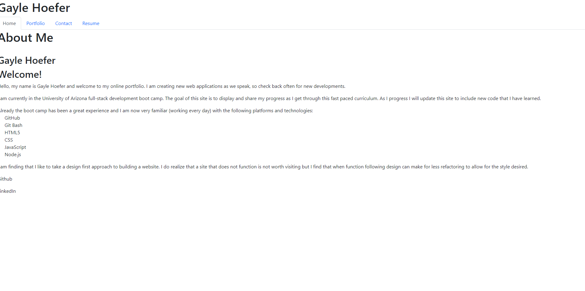

# Gayle Hoefer's Portfollio



## Table of Contents  
* [Description](##Description)  
* [Installation](##Installation)
* [Usage](##Usage) 
* [License](##License)  
* [Contact](##Contact)  

## Description

This react web application is a portfollio of Gayle Hoefer's work. It includes an about me, portfolio, resume, and contact me section. This web application is meant to allow future employers to see what work Gayle has completed. It is also in an easily sharable link so that it can be added to Gayle's resume.

## Usage

Go to the website listed above. Then click on the taps listed at the top to switch pages. If you would like to contact Gayle, fill out the contact me form. You will be asked for your first and last name, email, and message


## Installation

1. Clone the repo
   ```sh
   git clone https://github.com/hoeferg/hoeferportfolio
   
2. Install NPM packages
   ```sh
   npm install
   ```
3. Start the application
   ```sh
   npm start


## License

No license

---

## Contact
Gayle Hoefer - [LinkedIn](https://www.linkedin.com/in/gayle-hoefer-61a2a3124/) - [Github](https://github.com/hoeferg)

